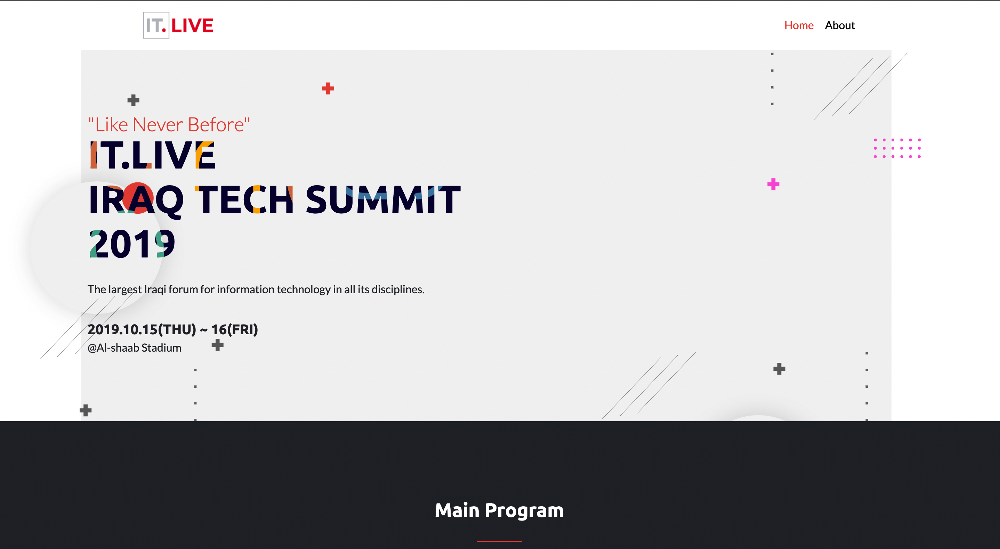
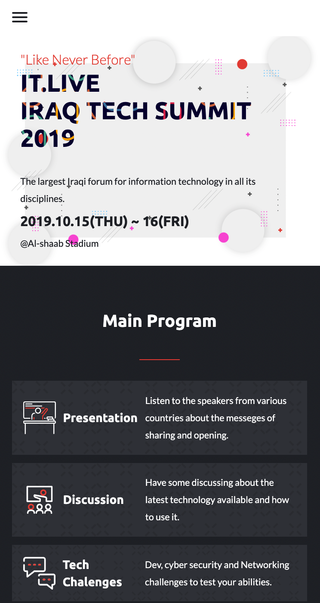

# Mohammed Salah Personal Portfolio

This is a web site for the IT Live Summit for 2019.

# Who is IT.LIVE

It is the first Iraqi conference concerned with raising various issues
related to information technology, as this field
has not been addressed across the country through previous conferences and activities, and this is
what our conference
aims to achieve.
What can we look forward to in #IT_Live_2017?
There will be a number of experts in this field discussing different topics, a number of
competitions, entertainment
events and gifts, companies and individuals with experience in this field who will present their
ideas and other
activities that will be announced soon.
When is the conference date?
End of February 2017, dates and times will be announced soon along with the application form for
attendees and speakers.

# Screen Shots

## Desktop Version

## Mobile Version

## Built With &hearts;

- HTML
- CSS
- JavaScript

## Live Demo

[Ckeckout The live Site here](https://mo7amedsmahdi.github.io/JavaScript-Capstone-Project/)

## Getting started

to run the project locally, clone the project using the command

`git clone git@github.com:Mo7amedSMahdi/JavaScript-Capstone-Project.git`

### Run test

navigate in to the project directory, from GitHub,
to test or run the application double click on the `index.html` file to open in your browser

## Authors

👤 **Author**

- GitHub: [@Mo7amedSMahdi](https://github.com/Mo7amedSMahdi)
- Twitter: [@devMo7amed](https://twitter.com/devMo7amed)
- LinkedIn: [LinkedIn](https://www.linkedin.com/in/mohammed-mahdi-b20340162/)

## 🤝 Contributing

Contributions, issues, and feature requests are welcome!

Feel free to check the [issues page](../../issues/).

## Show your support

Give a ⭐️ if you like this project!

## Acknowledgments

- Hat tip to anyone whose code was used
- Microverse program
- My standup team
- Microverse team
- My family's support

## Credit

The original design is created by [@Cindy Shin](https://www.behance.net/adagio07)
You can check the original design on [@behance](https://www.behance.net/gallery/29845175/CC-Global-Summit-2015)

Thanks for IT.Live [@IT.LIVE](https://www.facebook.com/ITLiveForum)
